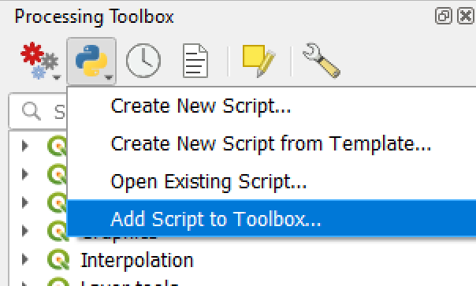

QGIS Processing Script – Pick point on map
==========================================

Pick a point on the map canvas and return as a layer

Install script in Processing Toolbox
------------------------------------

On the **Processing Toolbox** click the

**Scripts** tool

Choose the **Add script to Toolbox** menu item

Open the **pick_a_point.py** file from the location you downloaded or unzipped
the file to

The **Pick a point on map** script is now available from the **Custom scripts**
group in the **Scripts** section of the **Processing Toolbox**

